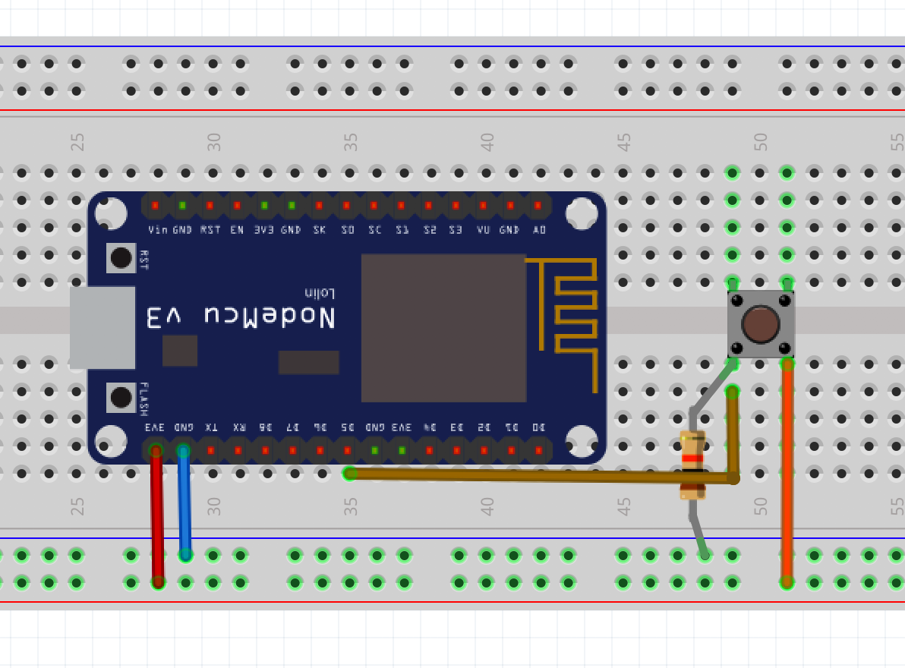

### Software Engineering for IoT and BigData

### Lab 1 - Getting data from sensors!

### Required elements.

1. [DHT-11 - Humidity and temperature digital Sensor](https://www.sigmaelectronica.net/producto/dht11/).
2. [GL-5516 Photoresistor (analog sensor)](https://www.sigmaelectronica.net/producto/gl5516/)
3. [Push button](https://www.sigmaelectronica.net/producto/sw-6x6x4-3mm/)
4. A LED and some resistors

In this exercise, you will assemble a circuit with a humidity/temperature sensor, a photoresistor, a button, a LED, and a NodeMCU-ESP8266 microcontroller. Once the circuit is correctly assembled, you should program it so it behaves as follows:

1. The microcontroller, once booted, does nothing (it should consume the least amount of cpu cycles)
2. Once the push button is pressed, the following process will run for 1 minute (note: pressing the button again before the X minutes shouldn't have any effect): 
	* The LED is turned on.
	* Each 2000ms, humidity and temperature readings are collected from the DHT11 sensor.
	* When temperature is between T1 and T2 (you set the interval values), and the photoresistor gives between 80% and 90% of the DAC value, a [dweet](https://dweet.io/) (a twitter for IoT devices!) is posted.
	* The LED is turned off and the process is finished (no more measurements/dweets will be performed) until the button is pressed again.

To implement the solution, you will explore the following:

* Hardware timers
* Hardware interrupt
* Physical phenomena to be considered in software (switch bounce).
* Timers/interrupts callbacks
* ADC
* Analog/digital sensors

#### Circuit prototyping on the breadboard

For the following steps, take into consideration the following diagram, which shows the equivalences between the NodeMCU pin names and the GPIO port numbers to be used in the code (e.g., DO is GPIO16, or port 16):

1. Assemble the circuit for the photosensor, using the analog GPIO port (A0). Use a 10k ohm resistor:

	

2. Assemble the circuit for the DHT-11, the and the button. The following schematics illustrates how to do so (use 10k ohm resistor for the button, and 200-400 ohm resistor for the LED):

	
	
	
	
	
### Considerations for Microcontroller. Target Quality Attribute: Energy Efficiency

1. For energy efficiency reasons, the microcontroller's, shouldn't waste CPU cycles innecessarily. For this reason, before the button is pressed, the microcontroller should be idle as much as possible, checking if the button was pressed once per second.
2. Consider that detecting the event of a HIGH value -on time- from the button in the main thread of the program would require to loop continiously (with little or no delays), hence, wasting CPU cycles. [There is an example on how NOT to detect such event if you want to save the battery of your device](https://learn.adafruit.com/micropython-hardware-digital-i-slash-o/digital-inputs). Instead, create an external interrupt for the GPIO pin connected to the button circuit, and add an interrupt handler, which, should be triggered when the pin changes its state. Before doing so, take into consideration the [practices the design of interrput handlers](http://docs.micropython.org/en/v1.9.3/pyboard/reference/isr_rules.html).
3. For the above point, read about the [switch bounce problem](https://www.allaboutcircuits.com/technical-articles/switch-bounce-how-to-deal-with-it/). Take this problem into consideration by addressing it either in the code or in the circuit (the latter is optional).
4. Follow the documentation on [how to use the DHT library to request the sensor to take measures, and how to read from them](https://docs.micropython.org/en/latest/esp8266/tutorial/dht.html), and how to use ESP8266's internal ADC (Analog to Digital converter)[the signal on the Analog GPIO pin (A0)](https://docs.micropython.org/en/latest/esp8266/tutorial/adc.html) (in this case, the voltage changes caused by the photoresistor). Take into consideration that ESP8266's analog pin has 10-bit resolution.
5. According to the DHT11 specifications, it requires at least 2000ms between each reading. Use a [timer to schedule a function callback](https://docs.micropython.org/en/latest/library/machine.Timer.html?highlight=timer#machine.Timer) that -once fired- reads the temperature and humidity values.
6. Once you have identified the conditions to post a dweet, use as a 'thing name': YOUR-STUDENT-CODE-LASTNAME. [Read how to post/check deets here!](https://dweet.io/)

### What to upload on Moodle:

- Source code (main.py)
- A picture of the circuit (breadboard + NodeMCU)
